:scrollbar:
:toc2:


== Red Hat Process Automation Manager Workshop
This workshop is aimed at providing hands on experience on the authoring and management platform for RHPAM. This lab will implement a Loan Approval workflow.

.Goals
* Explore Users and Groups Management
* Create a simple Loan Approval Workflow
* Explore Process Admin Operations (Dashboards, SLAs, Assignments, Ressignments)
* Explore Task Inbox (User Task Approval)
* Real-Time Process and Task Monitoring

.Prerequisite (Note: the last section of this workshop showcases how the process data can be visualized in a external reporting system like Kibana. If using a local install, you need to connect RHPAM to an elastic instance. Check link:https://developers.redhat.com/blog/2020/05/04/monitor-business-metrics-with-red-hat-process-automation-manager-elasticsearch-and-kibana/[Process Insights with Kibana])
* Successful completion of the _Environment Setup Lab_
or
* An existing, accessible, DM/PAM 7.5+ environment.

:numbered:

== Problem Statement
In this lab we will create an Loan Approval process.

* Customer initiates the Loan Approval request. 
* Pre Qualification checks are applied to the loan request.
* If the pre-qualification was succesful, then a suitable loan agent group is identified, the loan request is then assigned to them for approval.

== Users and Groups
In order to demonstrate the assignment and reassignment features, we will set up 3 sample groups and some users.
First, login to Business Central using the credentials provided.On the top right you will see an option for the settings view.

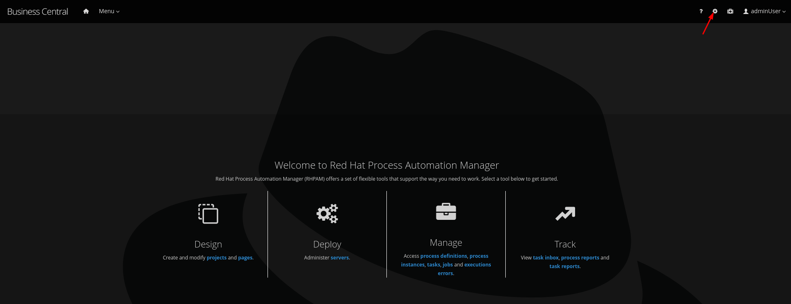

. Now click on the option for `Users`

. We will create 4 users. For creating a new user, click on the `New User` option.
+
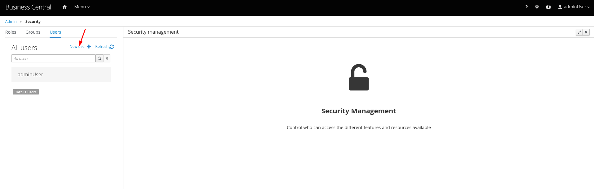
. Proceed with the wizard. Enter the username as `Mary`, then proceed on to add  role to user as below.
+
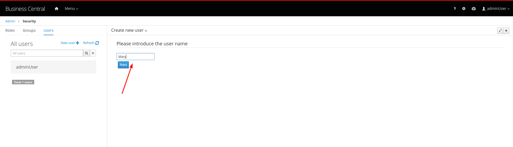
+
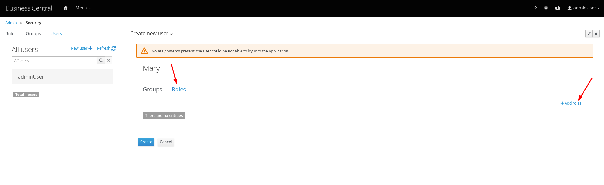

. Now choose, the role as `user`.
+
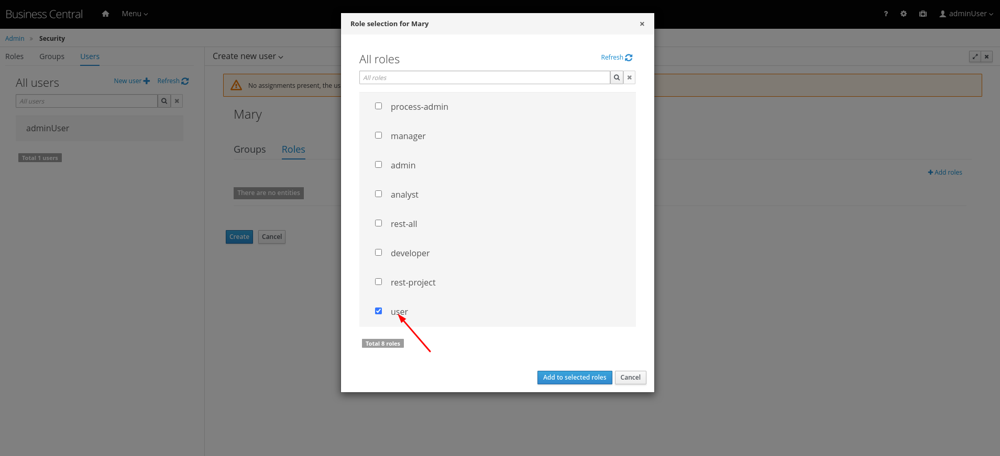

+
. Now click on the `Create` button.
. Finally set a password `redhatpam1!` for the user.
+
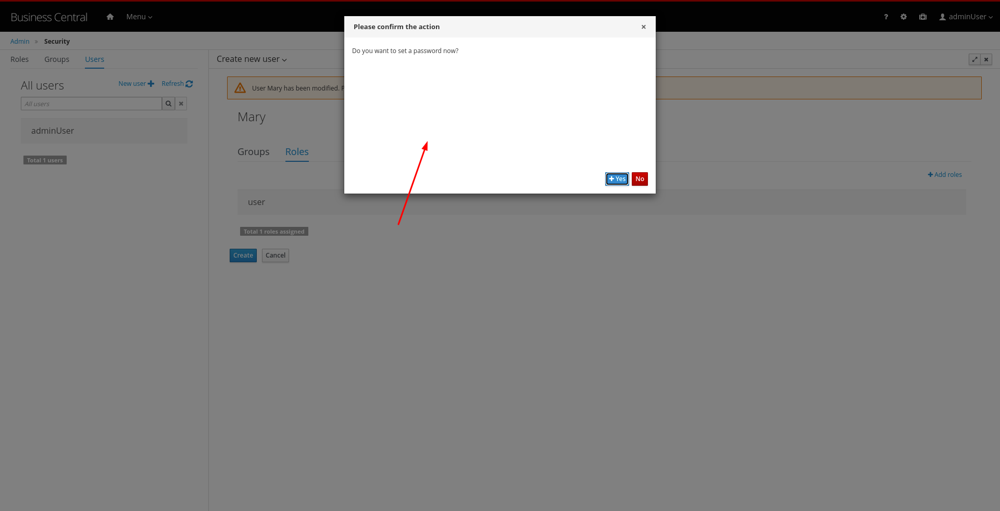
+
. Let us now repeat the same process to create 3 more users.
+
|===========

|Username|Password
|Robert|redhatpam1!
|Patricia|redhatpam1!
|John|redhatpam1!
|===========
+
Finally you will see the following users.
+
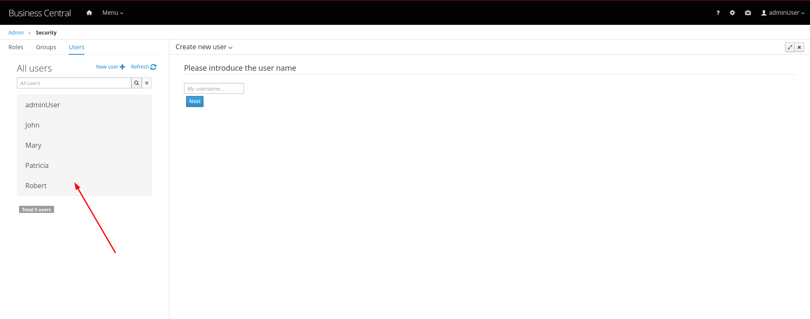
. Now let us create 3 groups. For this click on the groups tab as shown in the image.
+
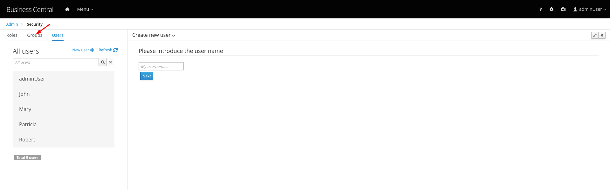
+
. Click on the `New Group` option. Provide a name for the group `seniorUserAgent.
+
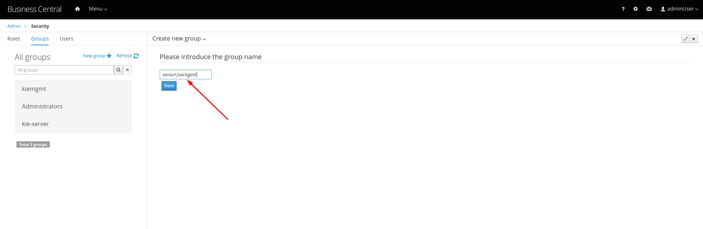
+
. Now you should see the list of users, show up. Choose the user `John` and click on `Add Selected User`.
+
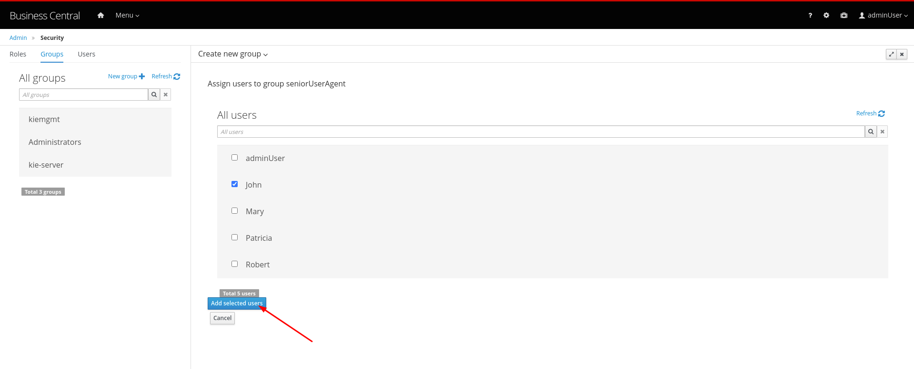
. Repeat the same process to create two more groups.
+
|===========

|Group Name|Users
|nonResidentGroup| Patricia
|loanAgent| Mary, Robert
|===========
. Finally you should see the following groups.
+
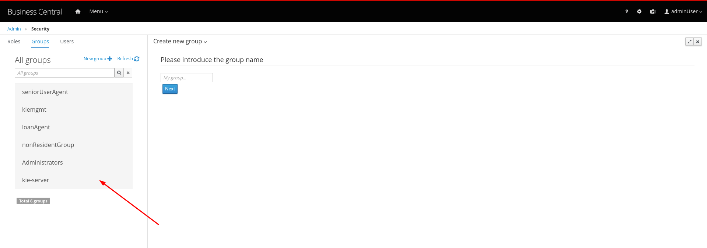


== Create a Project
To define and deploy a business process, we first need to create a new project in which we can store the BPMN2 model, our domain model and the forms required for user interaction. To create a new project:

. Navigate to {business_central}
. Login to the platform with the provided username and password.
. Click on **Design** to navigate to the Design perspective.
+
image:images/space_view.jpg[]
+

. In the Design perspective, create a new project. If your space is empty, this can be done by clicking on the blue **Add Project** button in the center of the page. If you already have projects in your space, you can click on the blue **Add Project** icon at the top right of the page.
. Give the project the name `loan-approval`, and the description "Loan Approval Process".
+
image:images/create_project.jpg[]
+

With the project created, we can now start building our solution.

== Solution

=== The Domain Model

The business process will collect and carry data through the execution of the process. This data is stored in a data model or domain model.

. In your project, click on the _Add Asset_ button in the middle of the screen.
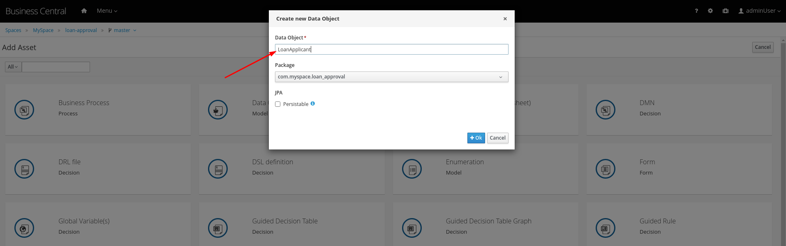
. In the drop-down menu in the upper-left corner, select `Model`. Click on the _Data Object_ tile.
+
image:images/add_asset_model.jpg[]
. Give the _Data Object_ the name `LoanApplicant`. Leave the package set to default.
+


. Add the following fields to the `LoanApplicant` data object by clicking on the `+ add field` button:

+
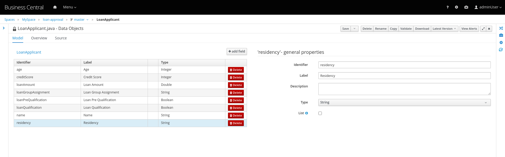

We can now create the required decisions for our process.

=== Creating the Age Pre-Qualification Decision

First let us create a simple Age Pre Qualification decision.

We will use the _Guided Decision Table_ asset.

> . Guided Decison are rules that you create in a UI-based table designer in Decision Central
> . Are a wizard-led alternative to uploaded decision table spreadsheets
> . Provide fields and options for acceptable input

. Now go back to the asset library and click on _Add Asset_ button. Choose the Guided Decision Table option.

+
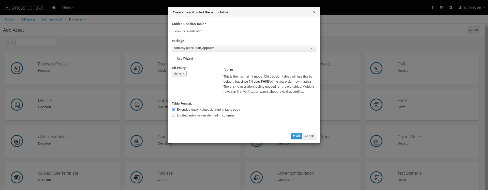
+

> Hit policies determine the order in which rules (rows) in a guided decision table are applied, whether top to bottom, per specified priority, or other options. 
+
For this example, we will leave it as the default selection.
+
Guided Decision tables provide wizard based approach to defining condition and action columns.
+
On the Guided Decision Table editor click on the Columns Tab.
+

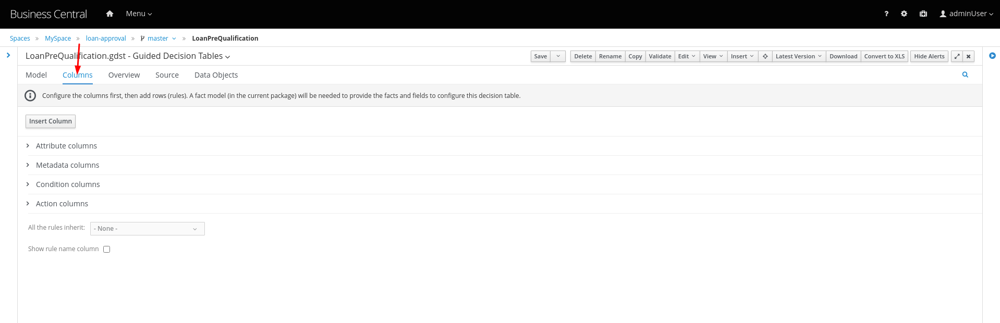


. To Add a condition colum click on the _Insert Column_ button. This will open up the wizard. Choose the _Add a Condition_ option and click on _Next_
+
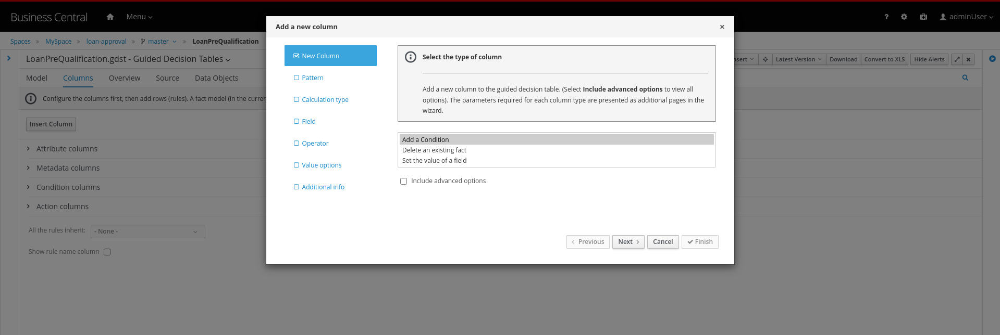

+

First we need to import the data objects which we will be using for the rule. For this click on the _Create a new Fact Pattern_ button.
+
Choose the `LoanApplicant` type and provide a binding variable. This is required so that we can start defining condition and action columns based on the _LoanApplicant_ object.

+

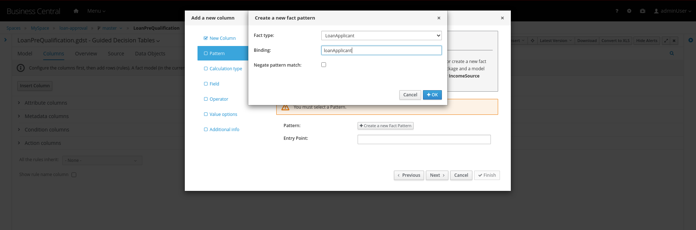
+
Next let us define the Calculation type, we will choose the _Literal Value_ and proceed.
+
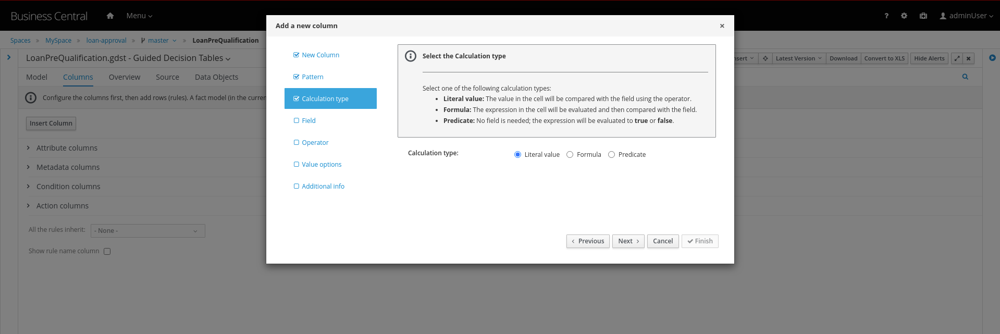
+
We will choose the `age` field.
+
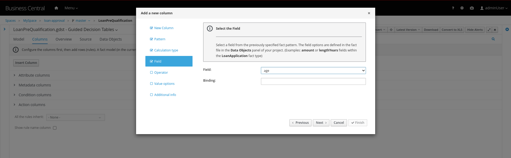
+
Since we need to define the Min age check, we will choose the operation as `greater than` and proceed.
+
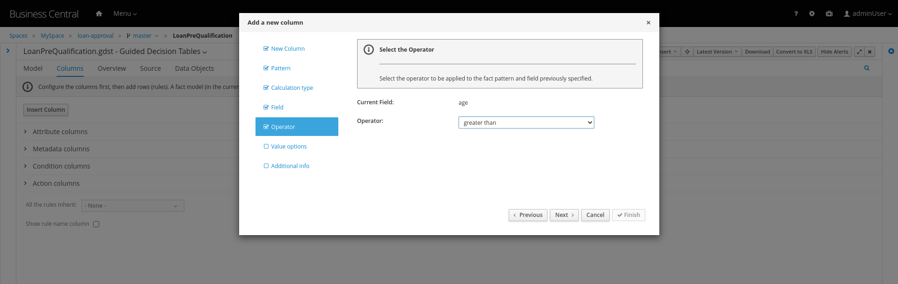
+
Finally we will give the column a header name and save the column definition.
+
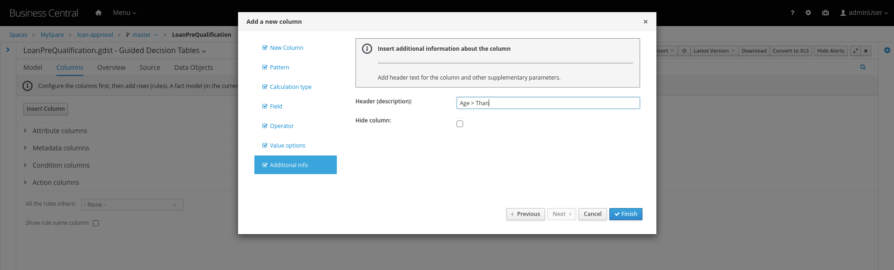
. Next we will define the Max Age column, repeat the same steps as above but choose the operation type as `less than` instead. We will name this `Age < Than`
+

+
. Next let us define the Credit Score.
+
For this click on `Insert Column`, choose the `loanApplicant` fact pattern, and choose the calculation type as `Literal value` column name as `creditScore`
+
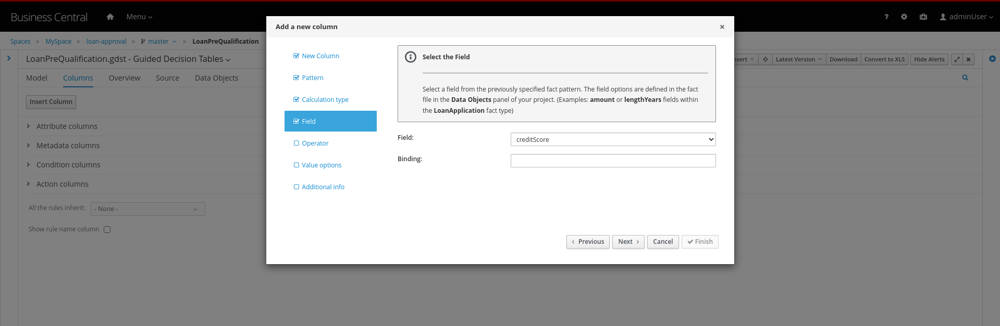
+
We will choose the operator as `greater than`, proceed on to provide a header name and save.
+
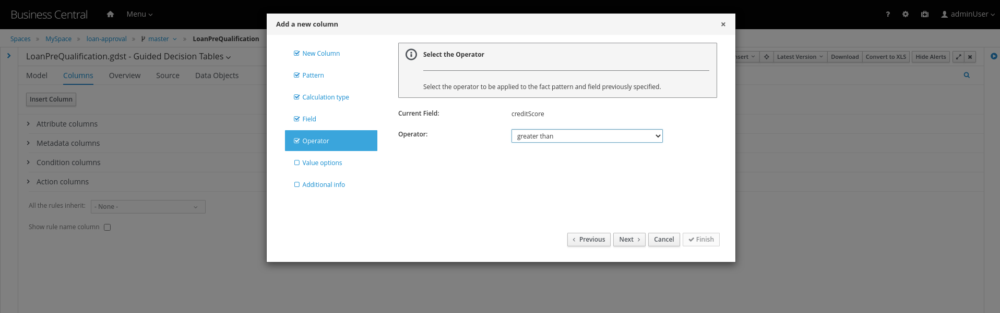

. Next we will define the check for `loanAmount`. For this click on `Insert Column`, choose the `loanApplicant` fact pattern, and choose the calculation type as `Literal value` column name as `loanAmount`
We will choose the operator as `less than`, proceed on to provide a header name and save.
+
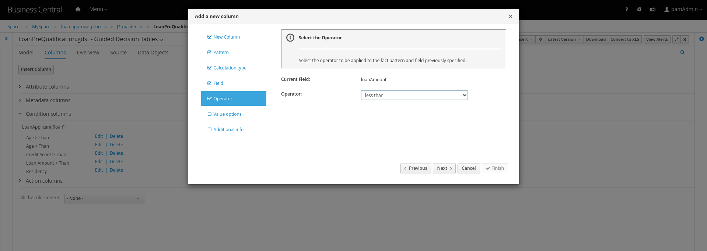
. Finally let us create a column for `residency`.
For this click on `Insert Column`, choose the `loanApplicant` fact pattern, and choose the calculation type as `Literal value` column name as `residency`
We will choose the operator as `equal to`, proceed on to provide a header name and save.
+
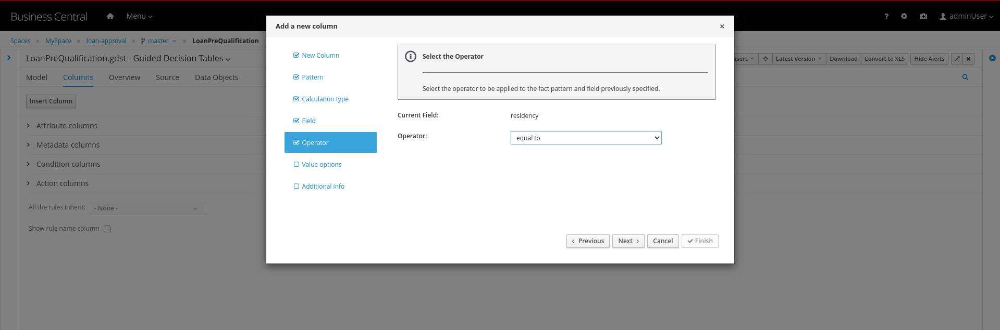

. Now we will define the action column. For this click on `Insert Column`. Choose the option for `Set the value of field` and click next.
+
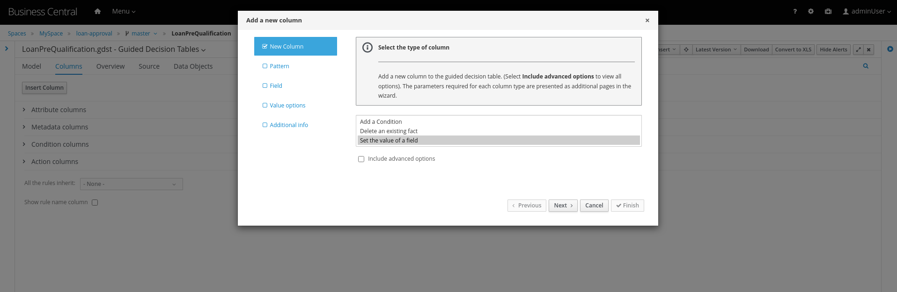
+
Choose the fact pattern `loanApplicant` and proceed. Choose the `Field` as `loanPreQualification`.
+
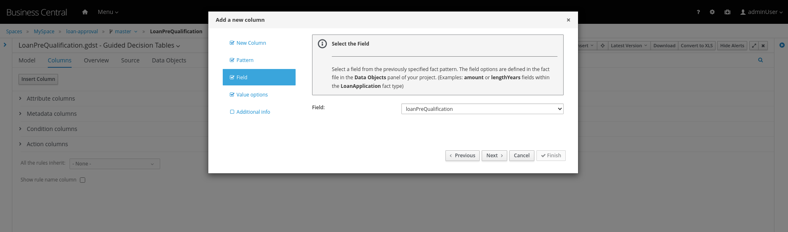
+
Finally add a header for the column and save.
. Now, we will add an Attribute column to the table. This will help us define the Rule flow group for this rule.
Rule flow Group provides a mechanism for grouping and executing rules. We will use this grouping on our process to indicate which rule to execute.
+
For this click on the `Insert Column` button. Check the box for `Include advanced options` and choose `Add an Attribute column` option.
+
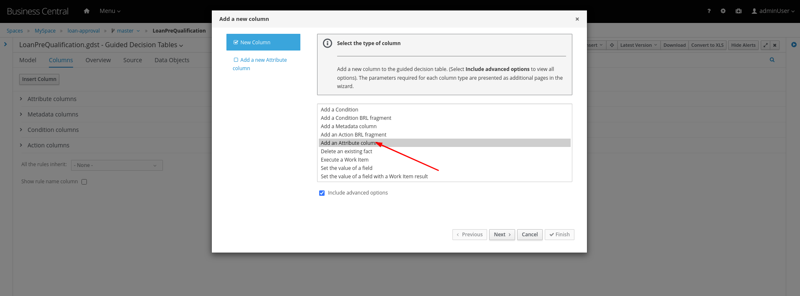
+
Choose the `Ruleflow-Group` option.
+
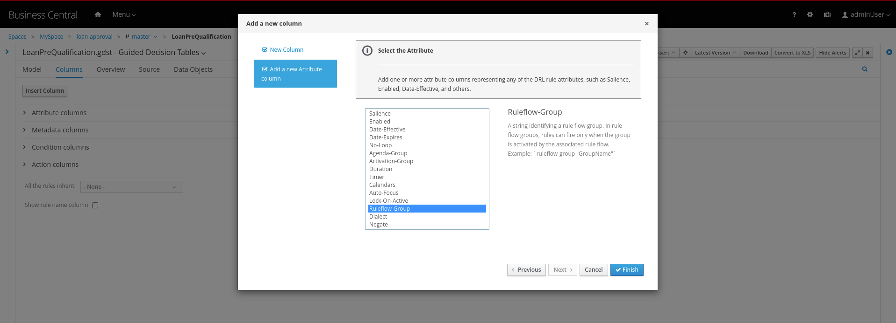
+
Now expand the `Attribute columns` section as shown below. Enter the `Default Value` as `loanPreQualification` and check the box to hide the column.
+
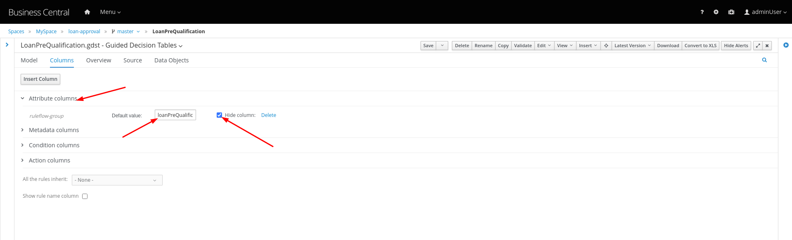

. Now switch back to the `Model` Tab, you can see the following table setup.
+
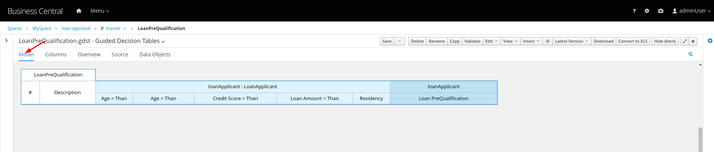

. Let us now fill up the table with values as below. For this choose the `Insert` button.
+
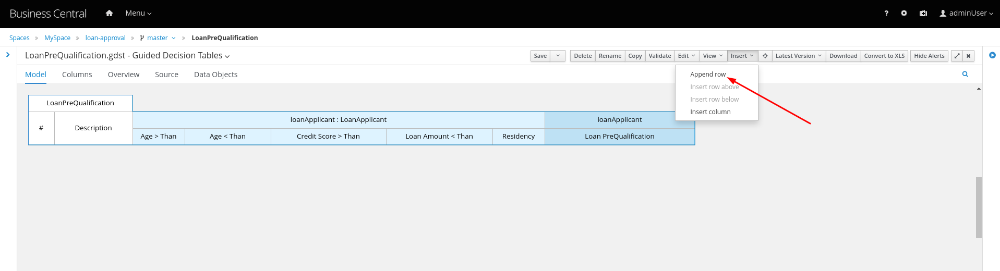
+
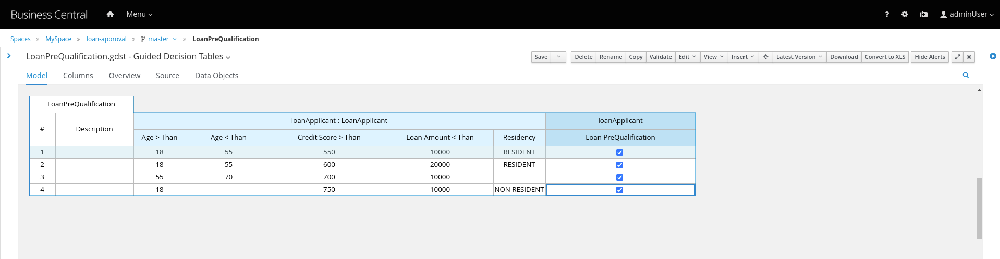
+
If you need to remove any of the cell values which you might have wrongly entered, right click on the cell and click on `Delete Cell`. If you need delete the whole row, select the row and right click to `Delete row(s)`

=== Creating the Group Assignment Decision
. Now, we will create another Decision table to dynamically determine which agent group to assign the loan approval request to. For this go back to the asset library and click on _Add Asset_ button. Choose the Guided Decision Table option.
+
For this decision table, we will choose the `Hit Policy` as `First Hit`.
+
image::image/image-2020-09-01-11-37-52-314.png[]
. Now let us define the columns. For this click on the `Columns` tab.
+
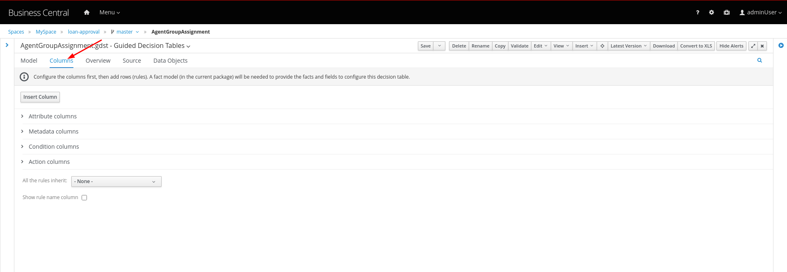
. Click on the `Insert Column` button, choose the option for `Add a condition` and click next. As we did earlier we will need to define a Fact pattern. For this click on `Create a new Fact Pattern`.
+
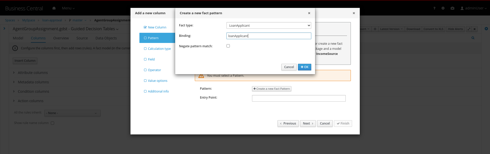
+
Create the fact pattern as above and proceed. Choose `Calculation type` as `Literal value`. Choose the `Field` as `age` and click on next. We will define the column as `greater than` as shown below.
+
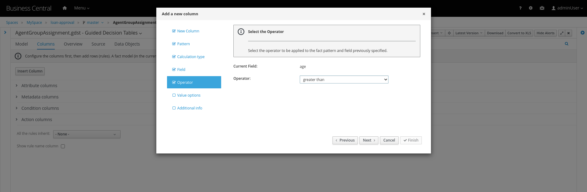
+
Provide a header name for the column and click on save
. Next let us create the next condition column. For this, click
on `Insert Column`, choose the fact pattern we created in the earlier step, choose the `Calculation type` as `Literal value`. Choose the `Field` as `residency`. For this we will define the operator as `equals to`
+
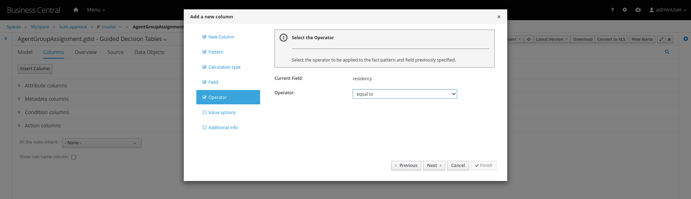
. Next let us define the `Action` column. For this click on `Insert Column` button, choose the option to `Set the value of a field`.

+
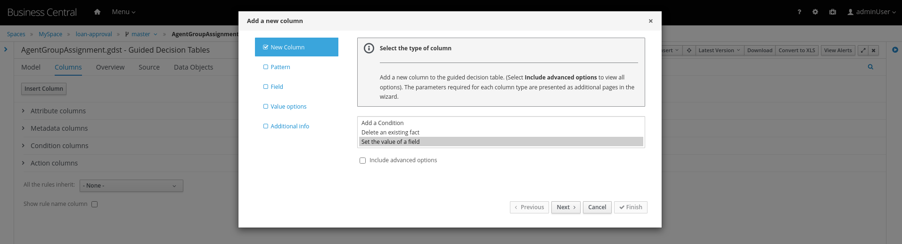
+
Choose the Fact pattern which we created earlier, choose the `Field` as `loanGroupAssignment`. Provide a header name for the column and save changes.

. Finally we will add an `Attribute` column for defining the Rule flow group. As we did with the previous decision table, click on `Insert Column`, choose the `Include advanced options` checkbox, and choose `Add an attribute column`.
+
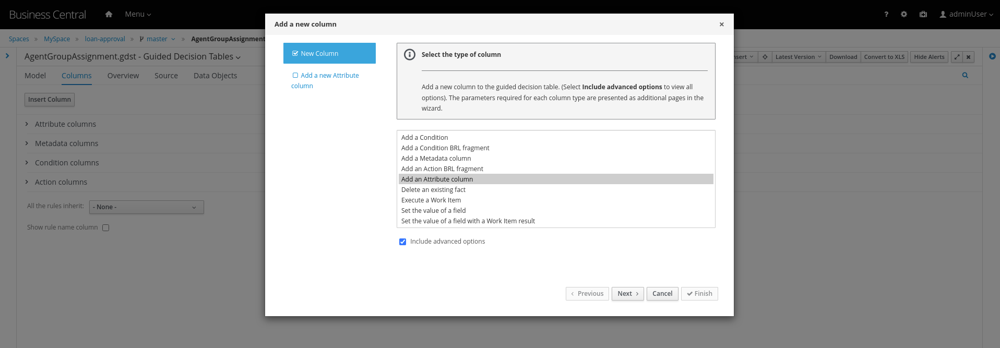
+
We will choose the Ruleflow-Group option.
+
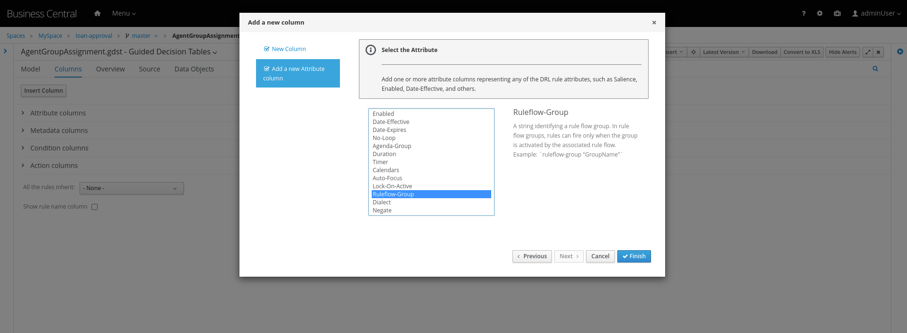
+
Expand the `Attribute Columns` and provide a default value for the `ruleflow-group` as below.
+
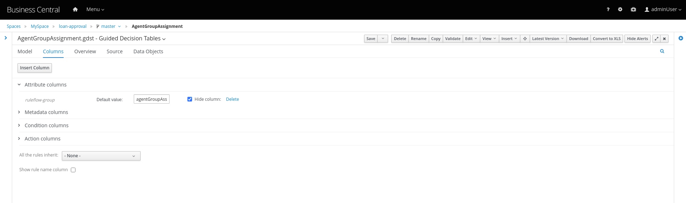
+
The table should now look like this. Next we will click on the `Insert` button to fill up the table as below.
+

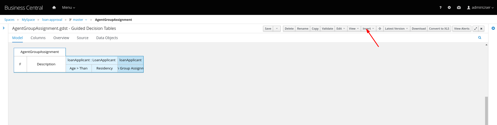
+
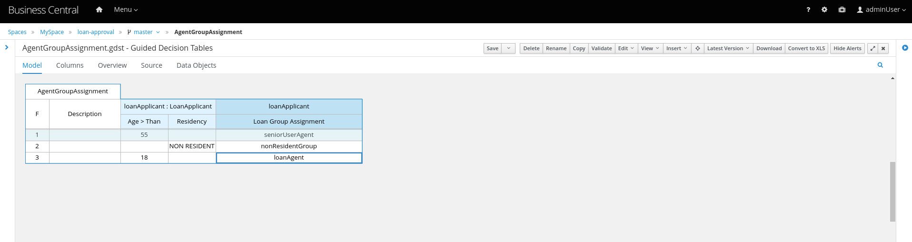


=== Creating the Loan Approval Workflow
Now that we have created all necessary pieces, we will now define the process. We will be building the following process flow.

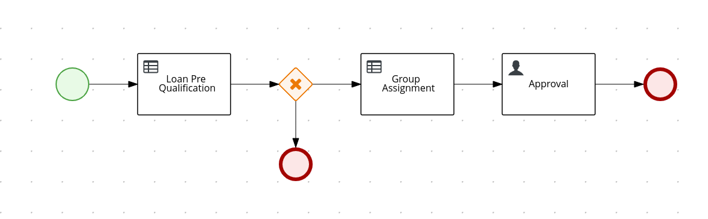

. First let us click on the _Add Asset_ button and choose the _Business Process_ type.
+
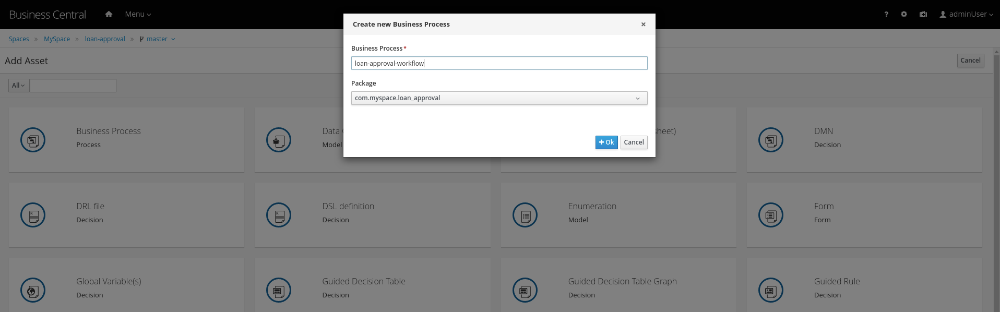

. When the process designer opens, click on the properties pane to open it up.
+
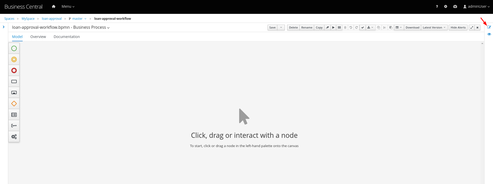
+
. Scroll down in the property panel on the right side of the screen, until you see the section _Process Data_.
. Expand the _Process Data_ section and add the following _Process Variable_ by clicking on the _+_ sign.
+

image::image/image-2020-09-01-13-50-50-735.png[]
+
. Next let us define the steps one by one. First drag drop the start node from the left side pane.
+

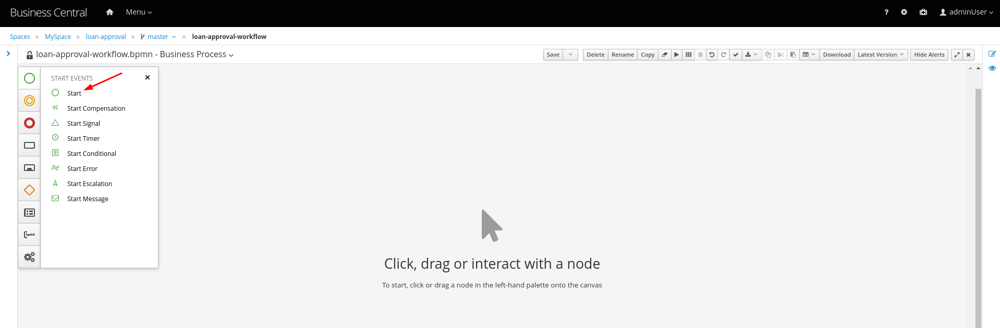

+
. Next we will define the _Loan Pre-Qualification_ node. For this we will need to choose the _Business Rule_ node. Click on the left side process palette on the Task(Rectangle) option and drag drop the node on to the canvas.
+

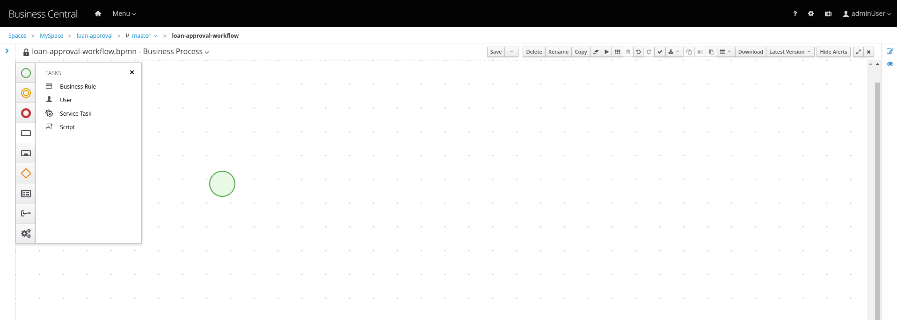
+
Now click on the node and edit the properties on the right side pane. We will give it a name and rule flow group as below.
+
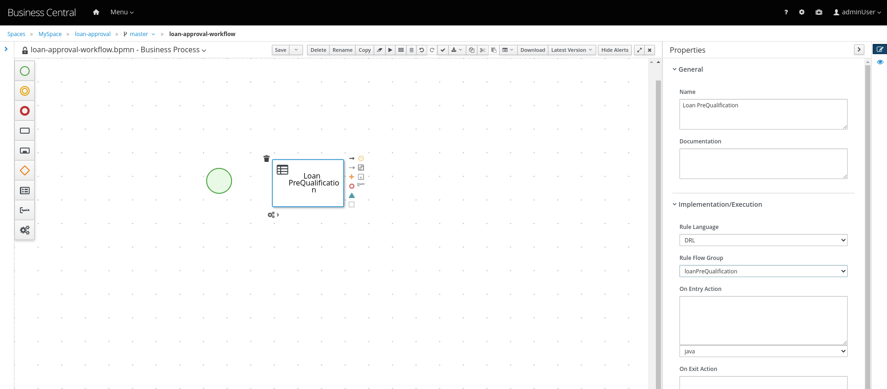
+
Next we will define the Inputs/Ouputs for the Rule. For this scroll down to the _Data Assignments_ section and click on the Assignments. We will map the `loanApplicant` as input and the `loanApplicant` as output.

+
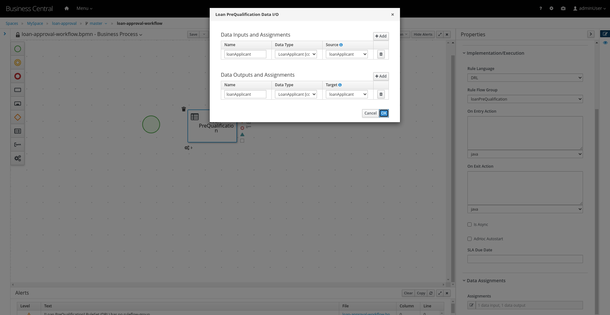
+
Next click on the Green circle(start node) and pull an arrow on to the _Business Rule_ node.

+

(Note: To connect any node click on the node and choose the context help displayed around the node to choose the arrow.)


. Next we need to define a gateway to filter only applicants with succesful Pre Qualification check. Click on the Rhombus from the process palette(on the left) and choose the Exclusive.

+
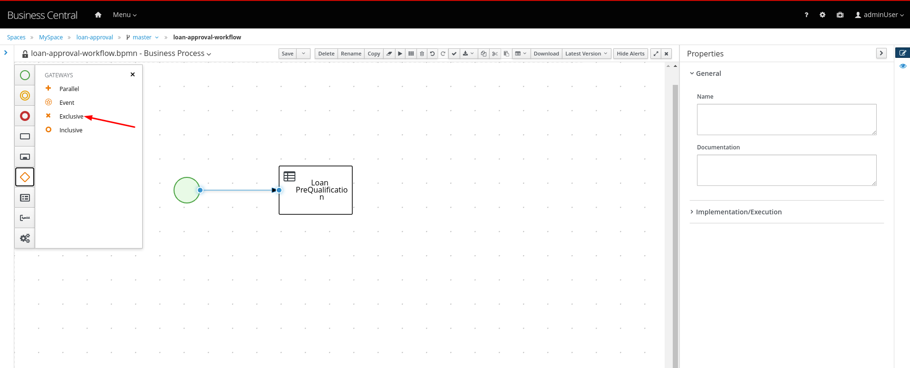

. Next we will need to invoke the Loan Group Assignment. For this click on the _Task_ node from the process palette(on the left) and choose the _Business Rule_ node.
+
We will edit the name and add the Rule Flow group as below.
+
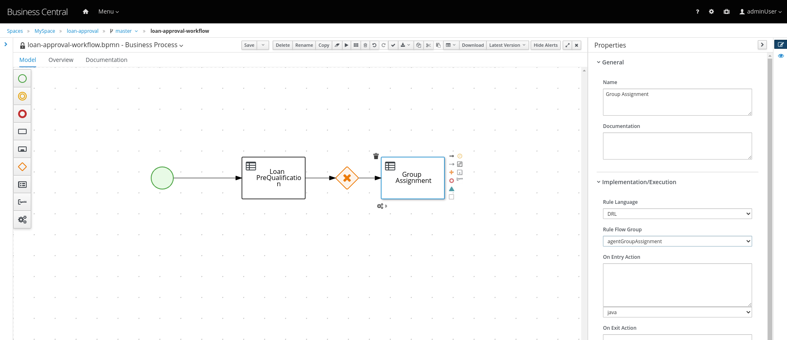
+
We will add the Assignment as we did in the previous step with the following definition.
+
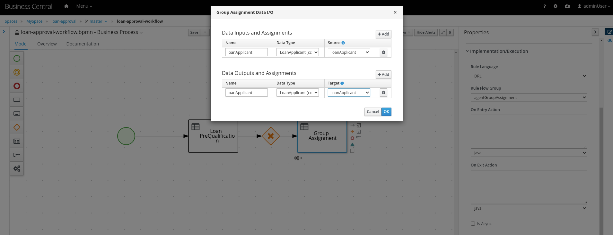
. We will also choose the Red circle from the process palette(on the left) and choose the _End_ event. Now we will connect the arrows between the _Loan PreQualification_, gateway and the _Group Assignment_ as below.
+
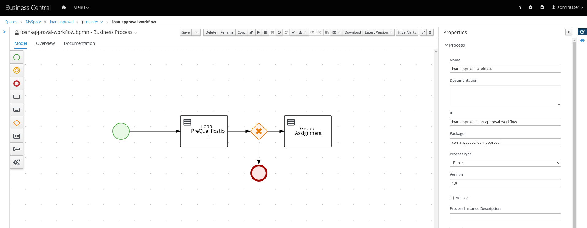
+
We will also need to define the logic for the gateway, for this click on the arrow to the _Group Assignment_ and expand the _Implementation/Execution_ section. Here we will define the logic as below.
+
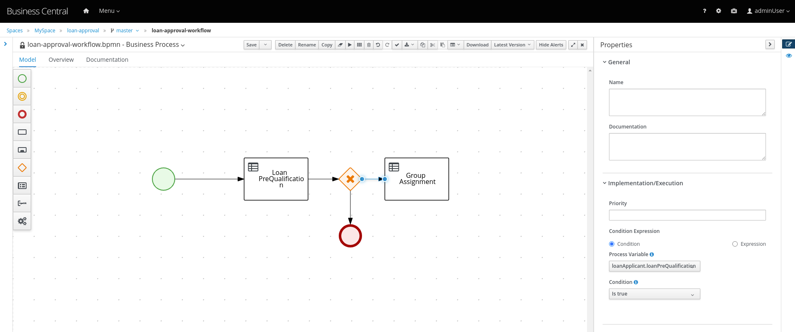
+ 
Make sure to define the condition on the other path which connects to the _End_ (red circle) as we did in the previous step.

. Last we will define a human task for the Loan Manager approval. For this click on the _Task_ node from the process palette(on the left) and click on the _User_ task. Drag drop the node on to the canvas.
+
We will edit the name and add the _Groups_. Add the value as
+
```
#{loanApplicant.loanGroupAssignment}
```
+
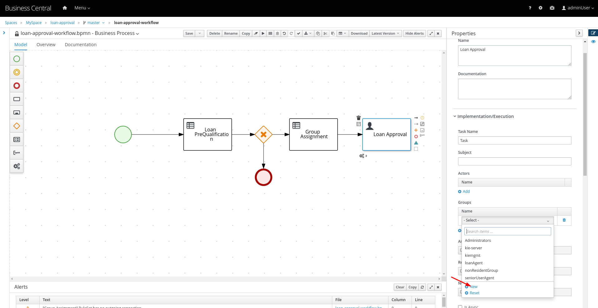
+

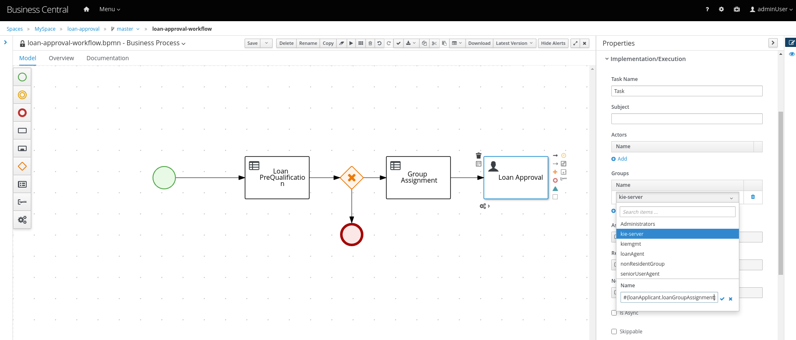
Next scroll down to the _Assignments_ section and add the following assignment.
+
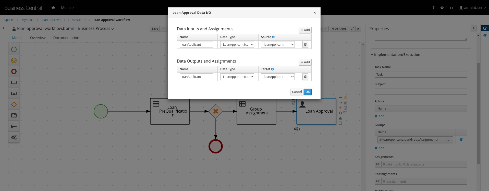

. Finally connect the `Loan Approval` task with the end node and connect the arrows.
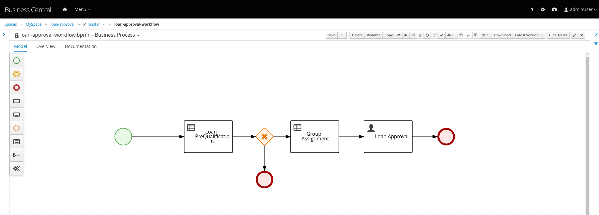
. Finally click on _Validate_ and it should be succesful.

=== Creating the User Forms
Next we will create User Forms to interact with the human tasks. We will set up one form to start the process and one for the Loan Manager Approval. 

. For this on the Process editor click on the following option and choose `Generate all Forms`.
+
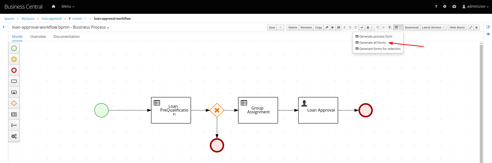
+
This will create a form with all possible values, we will now edit these forms to make sure we have the right fields.

. Go Back to the Asset Library view and filter by Forms. You should now see 3 forms generated.
+
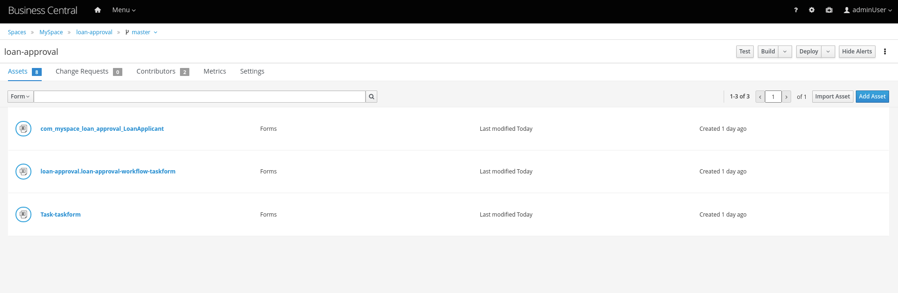
+
. Now open up the Form com_myspace_loan_approval_LoanApplicant
+
You can see the various fields possible for an `LoanApplicant`. Let us remove the field `Loan Pre Qualification`, `Loan Qualification` and `LoanGroupAssignment` by clicking on the three dots on the right side of the field. You can also rearrange the fields as you see fit.
+
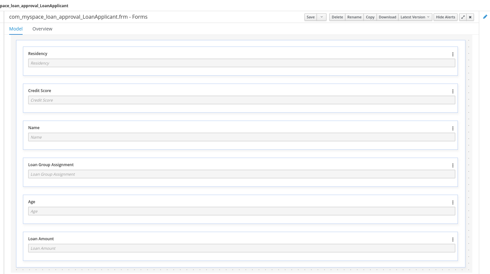
+
Save the changes.
+
Finally let us open up the User Task Form - `Task-taskform` and make sure the fields look up.
. Now we are ready to build and deploy the changes. Go back to the asset library and click on _Deploy_. (The Deploy action Builds & Deploys the changes).

=== Process Management and Tracking
. After the build is succesful, click top menu option and choose _Process Definition_.
+

. We can see the Process Defintion listed, now click on the three dots on the right side of the Process `loan-approval-wkflow`. Click on _Start_
+
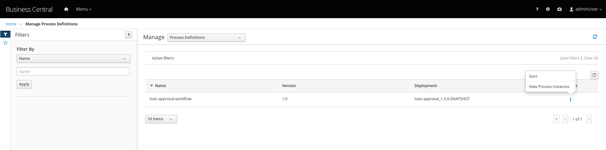
. This should open up the Process Start Form.
Enter the values for the form and proceed.
+
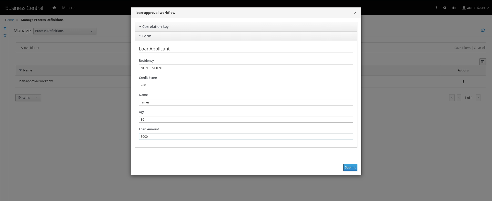

. We can now see the Process Instance View load up automatically.
+
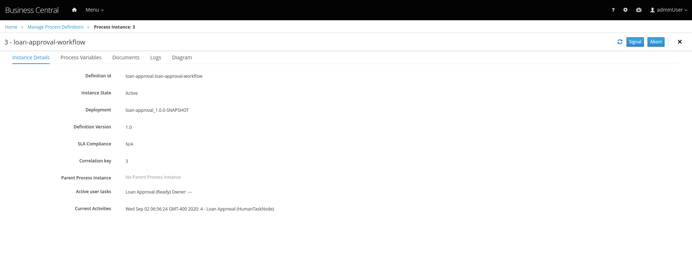
+
Inspect the Process Summary

. Click on the Diagram Tab on the Process Instance View. 
+
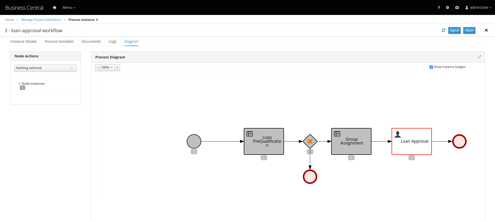
+
You can see that the completed steps show up in grey color and the current task in progress shows up with a Red outline.

. Let us now quickly explore the admin options on the `Process Instances` tab.
+
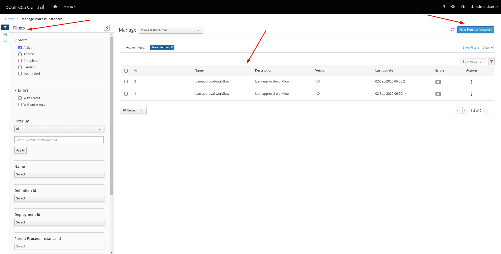
+
To start with, you can see that there is a `Filter` section on the left. This section lets us manage the filter criteria for this dashboard. The default filter options based on status, SLAs and Process definition are all mentioned here. This perspective also allows you to create a `New Process Instance`. The table shows the content filtered based on the criteria specified.

. Let us now explore some complex monitoring options. Assuming that, you will need to track SLAs on the process and alert when they breach. For this go back the designer and open up the Process for authoring again.
+
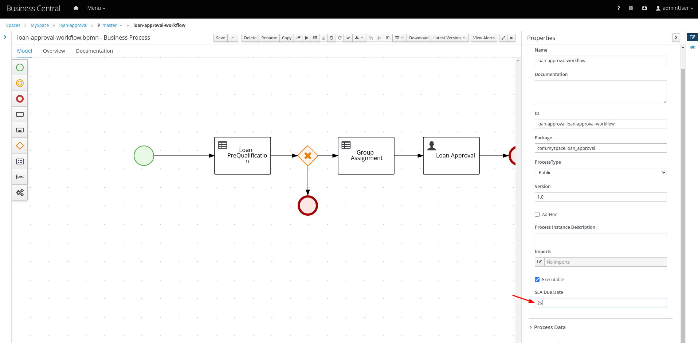
+
On the authoring perspective, as shown above, let us set an SLA. Save, build and deploy the changes.
+
Let us create a new process instance as we did earlier, with the same input data.
+
Now go back to the `Manage` perspective and navigate back to the `Process Instance` section. Since, we set the SLA as 2s it will almost immediately go in to the violated state. Let us verify that here. From the left side filter section, select the SLA violation.
+
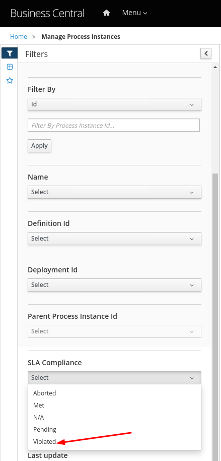
+
You should see that the SLA violation related results loads up on the right hand side.
. The `Manage` section also provides for a way to define custom queries on the process data. The following diagram shows how you can setup a custom filter.
+
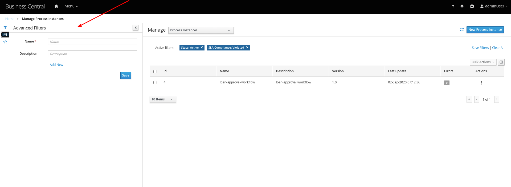
+
Now let us go back process which we last created, The task is assigned to a loan agent group dynamically at runtime based on the rules we configured. Let us see which group this assignment has been done for. For this click on the `Tasks` option from the `Manager` menu option.
+

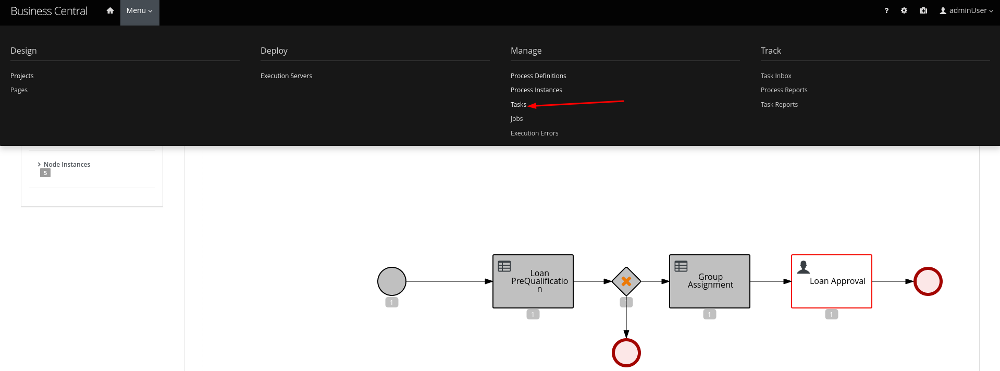
+
You will now see the task management perspective.
+
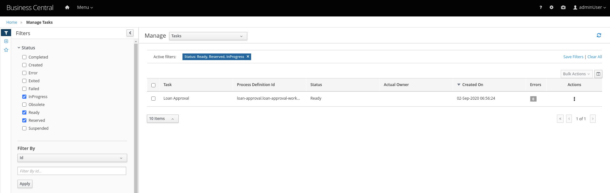
+
Open up the task, and navigate to the `Assignments` tab.
+
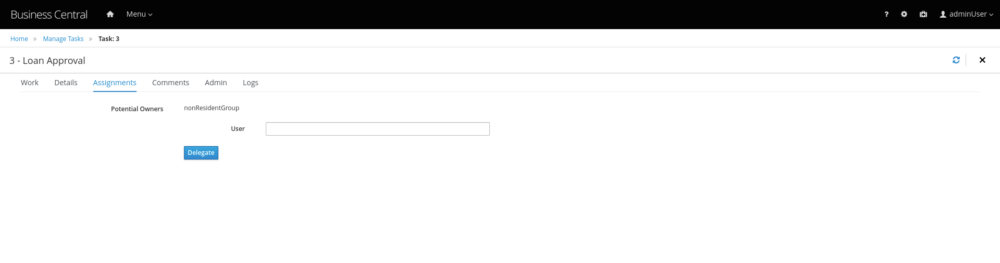
+
You can see that the task is assigned to `nonResidentGroup` because the customer is a NON RESIDENT.
+

. Let us now try to change the rule logic which governs this assignment. Go back in to the `Design` perspective and open up the guided decision table `AgentGroupAssignment`.
+
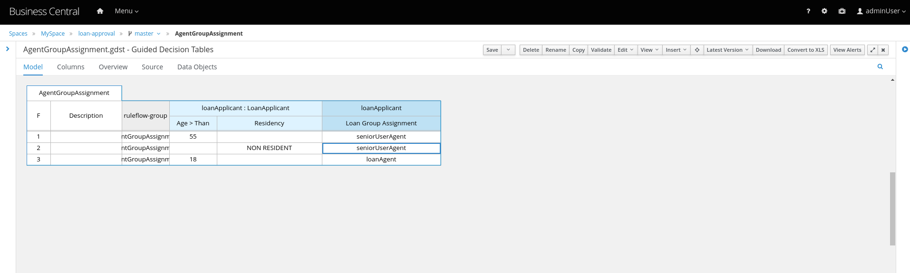
+
Make some changes to the second row, so that we assign NON RESIDENT cases also to the seniorUserAgent. Now save the business rule, build and deploy the changes.
+
We will now create another process instance using the very same input test data.
+
Now go in to the `Manage` perspective and open up the `Tasks` section. If we inspect the last task created, we can see it has now been assigned to `seniorAgent` instead of `nonResidentGroup`.
+

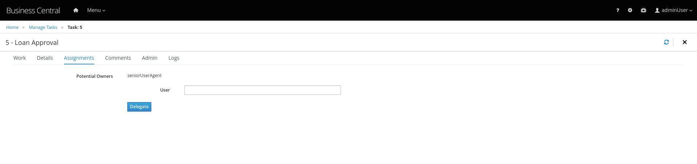
+
. Next let us assume that the group of users are overloaded with work, so we want to make sure the tasks are not in pending state for a long time. For this we want to put some controls in such that, if a tasks is not started by a group until `x` mins/hours we want to ressignment to somebody. Let us now move back to the `Design` Perspective and open up the business process.
+

On the Process, click on the `Loan Approval` task. On the right side pane, expand the `Implementation/Execution` section. Here click on the `Reassignments` section.
+
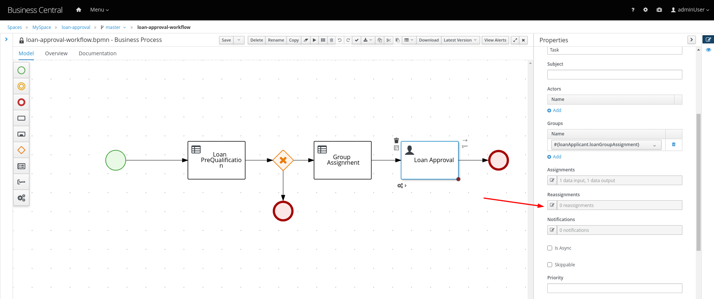
+
Click on the `Add` button and provide the reassingment strategy as below.
+
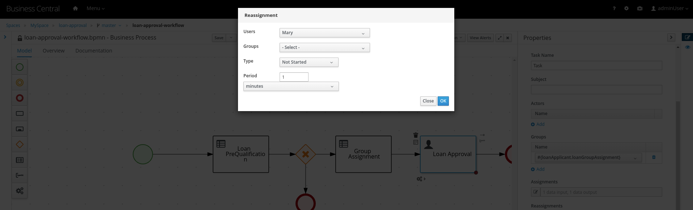
+
Click on `Ok`, save changes, build and deploy the project. Now navigate back to the `Manage` perspective and create a process one more time with the same test data.
+
The process should be created, let us wait a minute and open up the `Task` section on the management perspective.
+
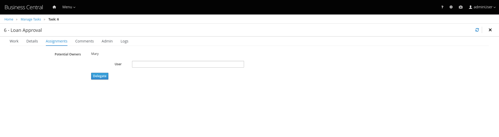
+
You can see that the task has been reassigned. Open up the `Logs` tab to see how the reassignment happened.
+
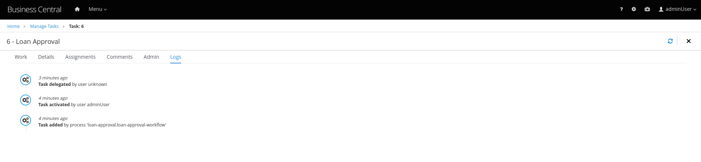

. Next let us look at how an admin can manually delegate tasks. Go back to the `Assignment` section. Now enter the `User` to delegate as `adminUser` and click on delegate.
+

+
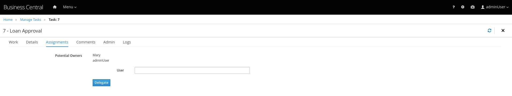
You can see the task has been reassigned to `adminUser` now. Also check the `Logs` tab to see the audit log of how the reassignment happened.

. Next let us go back to the `Task` dashboard by following the breadcrumb.
+
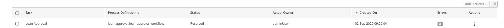
+
You can see that because of the assignment, the `Actual Owner` for the task has been changed to `adminUser` and the task is now in the `Reserved` state.
+
As you can see, the dashboard provides bulk operations on the tasks. This allows us to claim, suspend, start,release tasks.
+
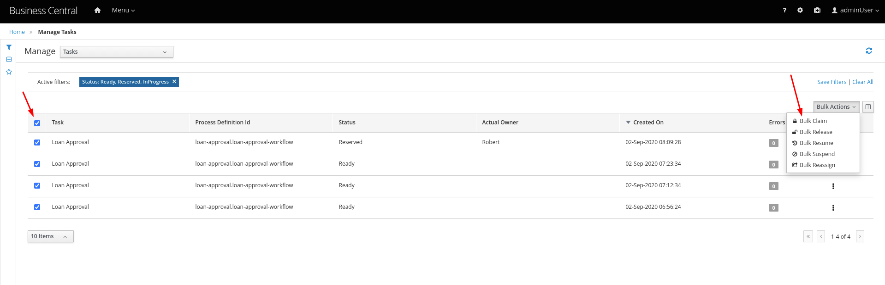

=== Task Inbox
. Task Inbox shows up assigned tasks for the user. This perspective allows the user to work on a task. Lets now login as `adminUser`. Since we reassigned a task to that user, we should be able to see the task waiting on the inbox.
+
Click on the top section and choose the `Task Inbox`.
+
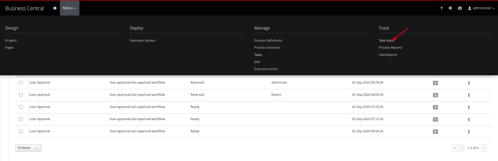
+
There should be a task waiting, open it up.
As you can see the task form shows up.
+
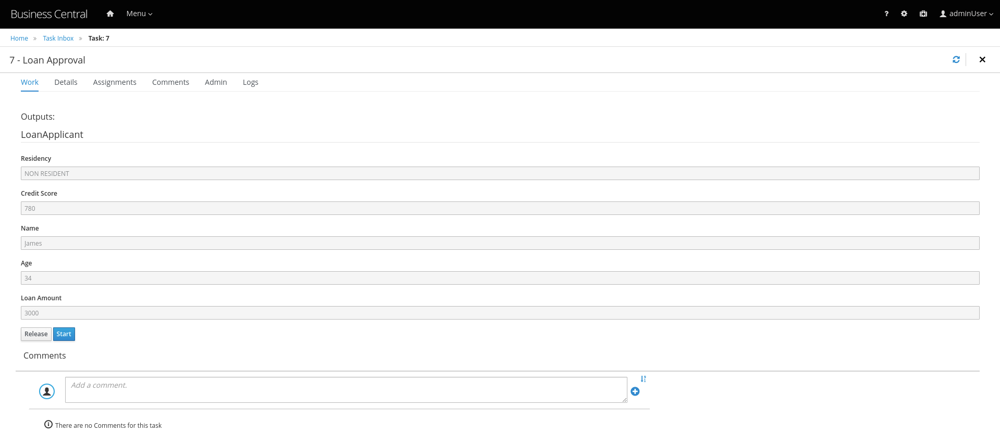
+
You can see that the details section allows for `Priority`  to be changed. This can be used in a reassignment strategy if need be.
+
Let us now switch back to the `Work` tab, and click on the `Start` button.
+
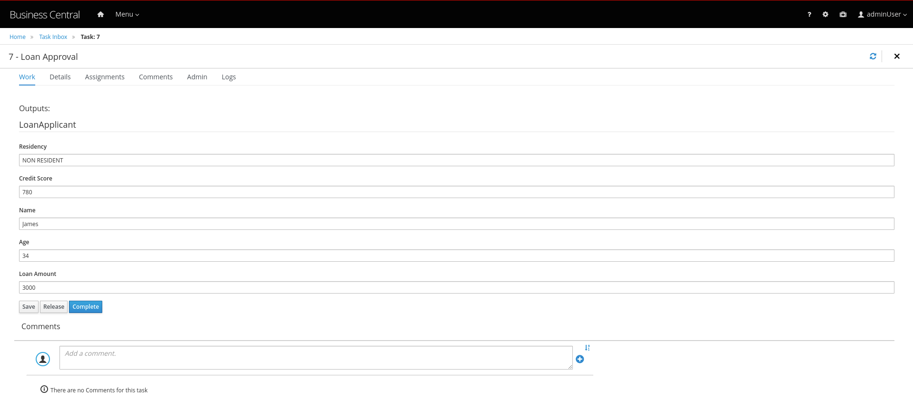
+
Now you can see additional options to `Complete`. Click on `Complete`. The task should now get completed.

